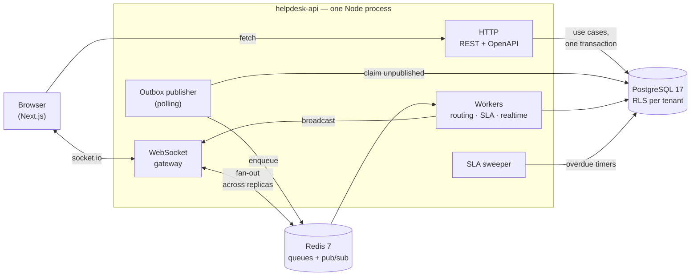
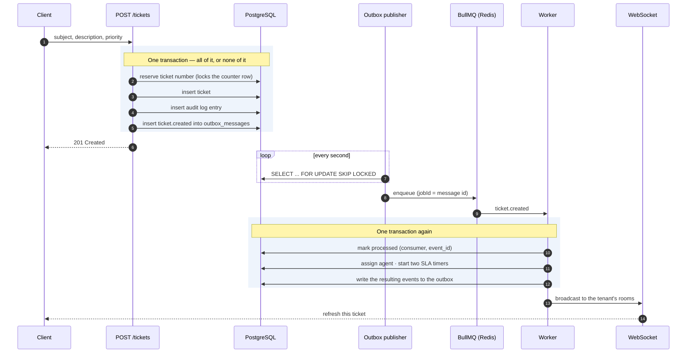

# helpdesk-api

A multi-tenant, event-driven helpdesk backend. NestJS, PostgreSQL with
Row-Level Security, a transactional outbox, BullMQ workers, durable SLA timers
and WebSocket delivery.

This is a portfolio project, and it optimises for a specific thing: **making
architectural decisions visible and defensible**, rather than shipping the
longest feature list. Every non-obvious choice is written down as an ADR —
context, the alternatives that were rejected, and what it would cost to reverse
it. There are [24 of them](docs/ARCHITECTURE.md).

The frontend lives in a separate repository:
[**helpdesk-web**](https://github.com/MarcosEstebanDev/helpdesk-web) (Next.js).

> **A note on language.** This README is in English. The ADRs in
> [`docs/ARCHITECTURE.md`](docs/ARCHITECTURE.md) are in Spanish — they were
> written as the decisions were being made, and translating them would have cost
> the nuance that makes them worth reading. This document is self-contained: the
> "Decisions worth reading" section below summarises each one, and the ADR link
> is there if you want the full argument.

---

## Run the whole thing

Both repositories, cloned side by side, and Docker:

```bash
git clone https://github.com/MarcosEstebanDev/helpdesk-api.git
git clone https://github.com/MarcosEstebanDev/helpdesk-web.git
cd helpdesk-api
docker compose -f infra/docker-compose.demo.yml up --build
```

That brings up Postgres and Redis, runs the migrations, seeds a demo
organisation, and starts the API and the web app:

| | |
|---|---|
| Web | <http://localhost:3001> |
| API | <http://localhost:3000> |
| OpenAPI / Swagger | <http://localhost:3000/docs> |

Sign in with organisation slug `acme-support` and any of:

| Email | Role | What they can do |
|---|---|---|
| `admin@acme.test` | ADMIN | Everything, including SLA policy |
| `agent@acme.test` | AGENT | Work the queue: assign, change status |
| `viewer@acme.test` | VIEWER | Open tickets and comment on their own |

Password for all three: `demo-password-123`.

**Watch the asynchronous part.** The seed writes tickets through the real use
cases, so the events it produces are still sitting in the outbox when the API
starts. Within a couple of seconds the workers drain them: tickets get
auto-assigned round-robin, and two SLA timers appear per ticket. Open a ticket
detail in one browser tab and comment on it from another — the first tab updates
without a refresh.

Everything in that compose file is a demo: the secrets are in plain text and the
database passwords are trivial. It is a way to see the system work, not a
deployment.

---

## The system



The workers run inside the API process here, but only because
`WORKER_ENABLED=1`. Set it to `0` and the same image is an HTTP-only node; run a
second copy with it set to `1` and you have a worker fleet. That switch was built
in from the start so that splitting the deployment never requires touching code.

### What happens when someone opens a ticket

This is the path worth understanding, because it is where most of the design
effort went.



Three properties fall out of that shape:

- **The event cannot be lost, and it cannot lie.** It is written in the same
  transaction as the ticket. There is no window in which the ticket exists but
  the event does not, and no window in which an event describes a ticket that was
  rolled back. That is the whole point of an outbox — the alternative, publishing
  to the queue right after committing, fails exactly when the process dies
  between the two.
- **The worker can safely run twice.** Delivery is at-least-once, so it will.
  Idempotency is a row in `processed_messages` keyed by `(consumer, event_id)`,
  written *in the same transaction as the effect*. A dedupe check that commits
  separately from the work it guards is not idempotency, it is a race.
- **The request ID survives all of it.** It is a column on `outbox_messages`, the
  publisher hands it to the job, and events emitted by the worker inherit it. One
  search reconstructs the HTTP call and everything it caused.

---

## Decisions worth reading

Each of these has an ADR with the full argument and the alternatives that lost.

### Tenants are isolated by the database, not by the code

Every tenant-owned table has `tenant_id` and a Row-Level Security policy. The
application connects as a role that is **not the table owner, has no
`BYPASSRLS`**, and every table has `FORCE ROW LEVEL SECURITY` — so the policy
applies even to the owner. Tenant context is set with
`set_config('app.current_tenant', $1, true)` inside the transaction, which means
it cannot leak across a pooled connection.

The point is what happens when application code is wrong. A missing `WHERE
tenant_id = ...` is a normal bug in a normal week. Here it returns nothing
instead of returning someone else's data. The policies are fail-closed: with no
tenant set, every table is empty.

There is a subtlety that took a while to find. A custom GUC that has been set and
then reset comes back as the empty string, not `NULL`, and `''::uuid` raises
`22P02`. So the policies read
`NULLIF(current_setting('app.current_tenant', true), '')::uuid`, which collapses
"never set" and "reset" into the same safe answer.

→ [ADR-0003](docs/ARCHITECTURE.md#adr-0003--multi-tenancy-con-postgresql-row-level-security-row-level),
[ADR-0009](docs/ARCHITECTURE.md#adr-0009--tenant-context-vía-transacción--set_config),
[ADR-0010](docs/ARCHITECTURE.md#adr-0010--rls-multicapa-rol-de-app-restringido--force-rls)

### The three places that must see across tenants have their own roles

Resolving `slug → tenant` at login happens *before* a tenant is known. The outbox
publisher has no tenant context at all. The SLA sweeper looks for overdue timers
across every organisation. Under fail-closed RLS none of them can see anything —
which is correct, and inconvenient.

The answer is not to grant `BYPASSRLS` to the application. Each of these gets a
dedicated `NOLOGIN` role owning a `SECURITY DEFINER` function with
column-level grants, and each function returns the **minimum** possible: the slug
resolver returns an id, the sweeper returns `(id, tenant_id)` and nothing else.
The real work then happens inside `withTenant`, back under RLS.

→ [ADR-0012](docs/ARCHITECTURE.md#adr-0012--resolución-slug---tenant-sin-abrir-rls-rol-dedicado--security-definer),
[ADR-0019](docs/ARCHITECTURE.md#adr-0019--publicador-por-polling-idempotencia-en-base-de-datos-y-dlq),
[ADR-0021](docs/ARCHITECTURE.md#adr-0021--temporizadores-durables-en-base-de-datos-y-barrido-no-jobs-retardados)

### The audit log is written in the transaction it describes

An audit trail written after the fact is a log of things that *probably*
happened. A `TransactionManager` port plus `AsyncLocalStorage` lets a use case
join the ambient transaction, so the ticket, its audit entry and its outbox
message commit together or not at all.

This one produced the sharpest bug in the project. Returning `Result.err` from
inside a transaction **commits** it — nothing threw, so as far as Postgres is
concerned the work succeeded. A validation failure was leaving the reserved
ticket number consumed. `runTransactional` now turns an error result into an
exception purely to force the rollback.

→ [ADR-0016](docs/ARCHITECTURE.md#adr-0016--unidad-de-trabajo-explícita-el-auditlog-en-la-misma-transacción),
[ADR-0017](docs/ARCHITECTURE.md#adr-0017--numeración-visible-correlativa-por-tenant)

### The ticket lifecycle is a table, not a chain of `if`s

Legal transitions are declared as data in the domain layer, so they can be read
at a glance and tested by walking the table. `CLOSED` is terminal on purpose:
reopening would put two separate incidents, with overlapping SLA windows, in one
row. `RESOLVED → OPEN` is allowed, because that is the window where a customer
says it was not actually fixed.

→ [ADR-0015](docs/ARCHITECTURE.md#adr-0015--ciclo-de-vida-del-ticket-como-máquina-de-estados-en-el-dominio)

### SLA timers live in a table, not as delayed jobs

A delayed BullMQ job is the obvious implementation and the wrong one: flush Redis
and every pending deadline is gone. `sla_timers` is the source of truth, and a
sweeper polls for what is due.

Two details matter more than the mechanism. Timer state is **derived** from
`stoppedAt` and `breachedAt` rather than stored as a status column, so there is
no way for the status to disagree with the timestamps. And everything is dated
with the event's `occurredAt`, never the moment the job happened to run — a queue
backlog must not change whether an SLA was met.

"Responded" means a comment by someone answering *on behalf of the
organisation*. That is why `comment.added` is versioned at v2 and carries
`authorRole`, taken from the verified JWT and never from the request body.
Without it, a customer sending a follow-up would stop their own response clock.

→ [ADR-0020](docs/ARCHITECTURE.md#adr-0020--modelo-de-sla-dos-relojes-política-por-tenant-y-calendario-enchufable),
[ADR-0021](docs/ARCHITECTURE.md#adr-0021--temporizadores-durables-en-base-de-datos-y-barrido-no-jobs-retardados)

### Role filtering over WebSockets is a room, not an `if`

Sockets join `tenant:<id>`, and staff additionally join `tenant:<id>:staff`.
Membership is decided by the server at handshake time from the verified token.

The reason is failure mode. With an `if` at the emit site, one missing check
sends privileged data to everyone connected. With rooms, a socket that never
joined the staff room cannot receive what is sent there, however the emit is
written.

What travels the wire is a small view DTO, not the integration event —
`comment.added` carries the ticket id and no body, and the client refetches with
its own permissions. That way the role filtering the backend already does is not
duplicated, badly, in the browser.

→ [ADR-0022](docs/ARCHITECTURE.md#adr-0022--transporte-de-tiempo-real-handshake-con-jwt-rooms-por-tenant-y-adapter-de-redis),
[ADR-0023](docs/ARCHITECTURE.md#adr-0023--qué-se-emite-y-a-quién-un-dto-de-vista-no-el-evento-de-integración)

### Authorisation is a hierarchy, not a permission matrix

`ADMIN > AGENT > VIEWER`, and endpoints declare a **minimum** rank with
`@MinRole(...)`. The ordering lives in the domain, not in a guard, so the SLA
engine and the queue workers apply the same rule as HTTP. A permission matrix
would be more flexible and, at this size, mostly a way to get the same answer
after more indirection.

Roles are per membership — per tenant — never global.

→ [ADR-0014](docs/ARCHITECTURE.md#adr-0014--autorización-por-jerarquía-de-roles-no-permisos-granulares)

### Errors in the domain are values, and IDs are branded

Use cases return `Result<T, E>` instead of throwing; exceptions appear only at
the edges, where a controller maps an error code to RFC 7807 problem JSON. IDs
are branded types, so `TicketId` and `UserId` are not interchangeable even though
both are strings at runtime — the compiler rejects the argument-order mistake
that would otherwise be found in production.

→ [ADR-0005](docs/ARCHITECTURE.md#adr-0005--errores-como-valores-result-en-domainapplication),
[ADR-0006](docs/ARCHITECTURE.md#adr-0006--branded-types-para-ids)

---

## Layout

Hexagonal, with Clean's dependency rule: `infrastructure → application →
domain`. The domain imports nothing — not Nest, not Prisma.

```
src/
├─ modules/<bounded-context>/
│  ├─ domain/          entities, value objects, events, PORTS (interfaces)
│  ├─ application/     use cases — plain classes, no Nest decorators
│  └─ infrastructure/  ADAPTERS: Prisma repositories, controllers, queue processors
│
├─ shared-kernel/
│  ├─ domain/          Entity, AggregateRoot, ValueObject, Result, branded ids
│  └─ ports/           Clock, IdGenerator, TransactionManager, OutboxWriter…
│
├─ infrastructure/     cross-cutting: config, Prisma, outbox, queues, realtime,
│                      observability, tenant context
├─ bootstrap.ts        HTTP pipeline, shared by main.ts and the e2e tests
├─ main.ts
└─ seed.ts             demo data, written through the real use cases
```

Two bounded contexts: **`iam`** (organisations, users, memberships, sessions) and
**`ticketing`** (tickets, comments, audit, SLA).

Three conventions hold the structure up:

**Use cases are plain classes.** No `@Injectable()`, no decorators. They are
constructed in the module with `useFactory`, injected by the port's token. That is
why the unit tests run without booting Nest.

**Nothing depends on a concrete adapter.** Swapping Prisma, or argon2 for bcrypt,
is a change in one module file.

**Contexts talk through ports, not repositories.** `ticketing` needs to know
whether a user belongs to the organisation, so it declares a `MemberDirectory`
port describing exactly that, and one adapter satisfies it from `iam`. Importing
`iam`'s repositories directly would have welded the two contexts together.

`bootstrap.ts` exists for a specific reason: the e2e tests configure the HTTP
pipeline by calling the same function `main.ts` does. A test suite that assembles
the app slightly differently from production passes while testing a system nobody
deploys.

---

## API

All routes need a bearer token except `/health*` and register/login/refresh.
The full contract, with schemas, is at `/docs`.

| Method | Path | Min. role | |
|---|---|---|---|
| `POST` | `/auth/register` | — | Create organisation + first ADMIN |
| `POST` | `/auth/login` | — | Needs `organizationSlug` |
| `POST` | `/auth/refresh` | — | Rotates; reuse revokes the family |
| `POST` | `/auth/logout` | — | Idempotent |
| `GET` | `/auth/me` | any | Current session; `email` is read from the database, `role` comes from the token |
| `GET` | `/members` | AGENT | Directory of the caller's organization. Not VIEWER, on purpose |
| `POST` | `/tickets` | VIEWER | |
| `GET` | `/tickets` | VIEWER | Cursor-paginated; filters by `status`, `assigneeId`, `requesterId` |
| `GET` | `/tickets/:id` | VIEWER | Includes live SLA clocks |
| `GET` | `/tickets/:id/history` | VIEWER | Audit trail |
| `POST` | `/tickets/:id/comments` | VIEWER | |
| `PATCH` | `/tickets/:id/status` | AGENT | Rejects illegal transitions with 409 |
| `POST` | `/tickets/:id/assign` | AGENT | |
| `DELETE` | `/tickets/:id/assign` | AGENT | Back to the queue |
| `GET` | `/sla-policy` | ADMIN | Four priorities, each flagged as agreed or default |
| `PUT` | `/sla-policy/:priority` | ADMIN | |
| `DELETE` | `/sla-policy/:priority` | ADMIN | Back to the default |
| `GET` | `/health/live` | — | No dependencies, on purpose |
| `GET` | `/health/ready` | — | Postgres + Redis, via the app's own connections |

Refresh tokens travel in an httpOnly cookie scoped to `Path=/auth`. Errors are
`application/problem+json` (RFC 7807) with a stable `code`.

Reading `/sla-policy` is ADMIN-only, unlike the rest of the module where reading
is open to VIEWER. Response targets are a commercial term, not ticket data.

---

## Tests

```bash
pnpm test        # 184 unit — domain and use cases, no database
pnpm test:e2e    # 109 e2e  — real Postgres, real Redis, real sockets
pnpm typecheck   # tsc over everything, specs included
pnpm lint:ci
```

Unit tests cover what decides something. The e2e suite covers what only breaks
when the pieces are connected — and it has earned its keep:

- `rls-isolation.e2e-spec.ts` is the one to read first. It asserts that a tenant
  cannot read another tenant's rows even by id, that queries fail closed with no
  tenant context, and that `WITH CHECK` blocks inserting into someone else's
  tenant.
- The SLA suite injects a fake clock by **overriding the `CLOCK` port**, not the
  class, so a 24-hour target is verified in milliseconds while still exercising
  the real deadline calculation. Faking `due_at` in the database would only have
  tested the sweeper.
- The realtime suite runs `app.listen(0)` with real Socket.io clients and mounts
  the same Redis adapter as production. It found a leak: the adapter opens two
  connections outside Nest's container that nothing closed, so the process would
  not exit — "Jest did not exit" in tests, a container ignoring `SIGTERM` in
  production.
- `cors.e2e-spec.ts` exists because of the most expensive bug here. `enableCors()`
  with no options returns `Access-Control-Allow-Origin: *` and no credentials
  header. The frontend sends `credentials: 'include'` for the refresh cookie, and
  against that combination browsers discard the entire response. The API worked
  with curl and passed 99 e2e tests while being unusable by its only client —
  **supertest does not apply CORS policy**. That one came from integrating, not
  from reading code.

CI runs install → lint → typecheck → unit → e2e → build on every push. The
typecheck step is there because none of the others actually check the project's
types: `pnpm build` uses a tsconfig that excludes specs and compiles
incrementally, Jest does not diagnose files it merely imports, and type-aware
ESLint does not report TypeScript errors. Two real type errors went green through
all three.

---

## What this deliberately does not have

Being explicit about the edges is part of the point.

- **No billing.** Stripe per-seat with idempotent webhooks was planned and cut —
  it would have repeated patterns already demonstrated (idempotency, outbox)
  rather than adding a new one.
- **No member management, only a member directory.** `GET /members` lists who is
  in the organization, but there is no invite flow and no way to change someone's
  role through the API: the directory can be read, not written. It is why the seed
  still writes its AGENT and VIEWER users directly instead of going through a use
  case. The directory requires AGENT
  ([ADR-0025](docs/ARCHITECTURE.md#adr-0025--directorio-de-miembros-y-composición-del-principal)):
  handing the full staff list to a VIEWER — an end customer who filed a ticket —
  would be a harvestable phishing target served by an authenticated endpoint.
- **No participant names inside a ticket.** A comment carries an `authorId` and
  nothing else, and the directory is not open to VIEWERs, so the frontend labels
  people by their role in that ticket ("you", "requester", "assigned agent"). The
  planned fix is to enrich `GET /tickets/:id` with the participants of that
  ticket, not to loosen the directory.
- **No generated OpenAPI client.** [ADR-0004](docs/ARCHITECTURE.md#adr-0004--contratos-vía-openapi)
  says the frontend should generate a typed client from the spec. It does not
  yet; the client interface is maintained by hand. WebSocket messages are not in
  the spec at all, so that contract is kept in sync by eye. Known debt.
- **No OpenTelemetry.** Logs are structured and correlated, but there are no
  traces. The `request_id` on `outbox_messages` is the seam a `traceparent` would
  slot into.
- **Rate limiting is in-memory**, so it is per-instance. Fine for one node,
  wrong behind a load balancer; it needs the Redis store before scaling out.
- **SLA calendars are 24/7 only.** `SlaCalendar` is the interface where business
  hours would go.
- **`sla_timers` is never purged.** It grows with every ticket.

---

## Developing

```bash
corepack pnpm install
cp .env.example .env                                # then set the two JWT secrets
docker compose -f infra/docker-compose.yml up -d    # Postgres + Redis only
corepack pnpm prisma:deploy                         # 7 migrations
corepack pnpm start:dev                             # http://localhost:3000
corepack pnpm seed                                  # optional demo data
```

`infra/docker-compose.yml` starts dependencies only, for when the API runs on the
host. `infra/docker-compose.demo.yml` is the full stack from the top of this
document.

Two connection strings, by design: `DATABASE_URL` is the restricted application
role, `MIGRATION_DATABASE_URL` is the owner and is used only by `prisma migrate`.
The application must never hold a connection that can bypass RLS.

Notes for anyone picking this up:

- **Do not run `pnpm test:e2e` with a dev server up.** It has
  `WORKER_ENABLED=1` and will drain the outbox behind the suite's back. The
  failures look unrelated to the cause.
- The e2e suite runs `--runInBand`. The publisher is global by design, so in
  parallel one suite publishes another's messages.
- The whole `@nestjs/*` ecosystem is pinned to `^11`. Every v12 package is
  ESM-only and Jest cannot parse it — that cost time four separate times before
  it became a rule.
- To validate the migration chain from scratch, create a throwaway database and
  `migrate deploy` against it. Do not reset the development one.

---

## Stack

NestJS 11 · TypeScript 5.7 strict · PostgreSQL 17 · Prisma 6 · BullMQ 5 ·
Redis 7 · Socket.io · argon2id · Pino · Jest · Node 24 · pnpm 11

## Further reading

- [`docs/ARCHITECTURE.md`](docs/ARCHITECTURE.md) — the 24 ADRs, grouped by theme.
- [`helpdesk-web`](https://github.com/MarcosEstebanDev/helpdesk-web) — the Next.js
  client, including how it consumes the realtime channel.

## License

MIT — see [LICENSE](LICENSE).
